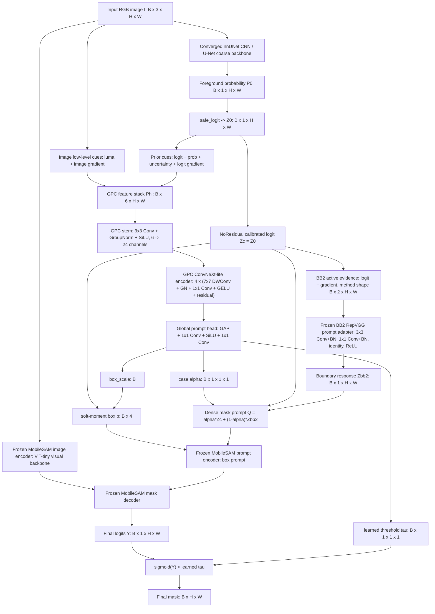
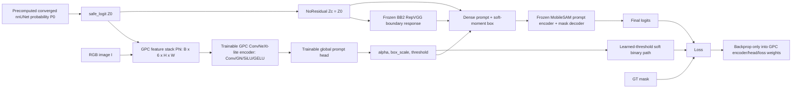
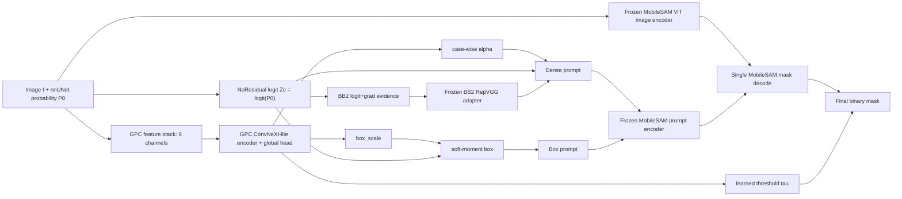

# SafeAnchor-GPC-v8c NoResidual 主线文档

Date: 2026-05-27

本文只覆盖 `E:\PA\safeanchor_repro_clean\paper_release_v8c` 当前主线已经实际使用的模块、训练、推理、数据形状和结果证据。本文不展开任何未进入当前主线的实验分支；所有结论均按当前 release 内的 config、代码、checkpoint、metric JSON 和 completeness audit 重新核对。

当前主线名称：

```text
SafeAnchor-GPC-v8c Teacher-Free NoResidual NoTemperature LearnedThreshold
```

当前主线一句话：

```text
nnUNet probability prior
  -> Generalizable Prior Calibrator (GPC-v8c, NoResidual)
  -> frozen BB2/SAM boundary bridge
  -> single MobileSAM decoding
  -> learned final threshold
  -> final binary mask
```

主线目标不是把系统做复杂，而是把一个强 nnUNet coarse prior 转换成一个稳定、可学习、可复现、跨 Kvasir 和 PH2 同构的 SafeAnchor prompt policy。V8C 的核心克制点是：不在 GPC 中做像素级 residual 修图，不做额外推理分支，不用验证集挑 checkpoint，不做 checkpoint soup；论文结果以 full 3-epoch training 的 `checkpoint_last.pth` 为准。

---

## 1. 核对边界

### 1.1 当前主线配置

当前主线 source of truth 是：

```text
configs/branch_safeanchor_gpc_v8c_paper_release.json
configs/branch_safeanchor_gpc_v8c_teacher_free_nores_notemp_learnthr_unified.json
```

两个 config 内容一致，关键字段为：

```text
method_family = SafeAnchor-GPC-v8c Teacher-Free NoResidual NoTemperature LearnedThreshold
single_path_per_case = true
safeanchor_final_mask = true
GPC pixel policy = identity prior (NoResidual)
BB2 evidence = logit + gradient
SAM logit temperature = identity
final binarization = learned threshold
```

这几个字段决定了论文叙事的边界：V8C 不是一个像素级 coarse refiner，也不是后处理器；它是一个从 prior 条件中学习 prompt 参数的 calibration 模块。

### 1.2 当前主线代码入口

训练入口：

```text
train.py --stage gpc
train_gpc_prior.py
scripts/run_train_kvasir.ps1
scripts/run_train_ph2.ps1
```

推理入口：

```text
run_safeanchor_gpc.py
scripts/run_eval_all.ps1
```

主线完整性审计入口：

```text
check_release_complete.py
audit_gpc_clean_mainline.py
```

核心模块文件：

```text
safeanchor/gpc_data.py
safeanchor/generalizable_prior_calibrator.py
safeanchor/dbp_prior.py                 only utility functions used by V8C
safeanchor/coarse_prior_calibrator.py    only build_bb2_maps_from_logit used by V8C
safeanchor/bb2_channel_prune.py
safeanchor/bb2_adapter.py
safeanchor/mobile_sam_wrapper.py
```

其中 `safeanchor/dbp_prior.py` 在 V8C 主线中只提供 `gradient_magnitude`、`soft_moment_box` 与 `uncertainty_weighted_sum` 三个工具函数；`DifferentiableBinarizedPrior` 类不是当前 V8C 主线模块。`safeanchor/coarse_prior_calibrator.py` 在 V8C 主线中只使用 `build_bb2_maps_from_logit` 生成 BB2 evidence maps；`FailureAwareCoarsePriorCalibrator` 不是当前 paper config 的 active coarse refiner。

### 1.3 当前 release 完整性

`RELEASE_COMPLETENESS_AUDIT.json` 显示：

```text
complete = true
scope = v8c GPC training/inference plus frozen upstream nnUNet/BB2/MobileSAM weights and probabilities
missing_required_files = []
```

数据完整性：

```text
Kvasir train880: images=880, labels=880, probs=880
Kvasir val50:   images=50,  labels=50,  probs=50
Kvasir test70:  images=70,  labels=70,  probs=70
PH2 train140:   images=140, labels=140, probs=140
PH2 val30:      images=30,  labels=30,  probs=30
PH2 test30:     images=30,  labels=30,  probs=30
```

预测完整性：

```text
outputs/pred_gpc_v8c_learnthr_unified_kvasir_val50_last: 50 png
outputs/pred_gpc_v8c_learnthr_unified_kvasir_test70_last: 70 png
outputs/pred_gpc_v8c_learnthr_unified_ph2_val30_last: 30 png
outputs/pred_gpc_v8c_learnthr_unified_ph2_test30_last: 30 png
```

---

## 2. 完整主线架构图

### 2.1 总体图



### 2.2 训练图



训练时只更新 GPC 参数和 GPC 内部的 learned loss weights。nnUNet probability、BB2 adapter、MobileSAM image encoder、MobileSAM prompt encoder、MobileSAM mask decoder 均冻结。

### 2.3 推理图



推理时每个 case 只有一条路径：一次 GPC，一次 BB2 response，一次 MobileSAM decode，一次 learned threshold binarization。

### 2.4 卷积与激活函数在主线中的位置

V8C 不是一个只处理 `1 x H x W` 标量图的纯公式系统。当前主线包含四层视觉表征能力：

```text
1. nnUNet 是完整卷积 U-Net coarse backbone，训练到收敛后输出 dense prior P0。
2. GPC 是轻量 ConvNeXt-style 卷积编码器，输入 B x 6 x H x W，不是纯 MLP。
3. BB2 是 RepVGG-style 卷积 prompt adapter，提供 frozen boundary response basis。
4. MobileSAM 使用 frozen ViT image encoder、prompt encoder 和 mask decoder 完成 single decode。
```

因此 `P0: B x 1 x H x W` 不是从零分割的唯一信息源，而是强 nnUNet coarse prior；GPC 再用卷积编码器从 prior geometry 与 RGB 低层边界中学习 prompt policy。NoResidual 只表示 GPC 不做像素级 coarse logit 修改，不表示主线没有卷积网络或激活函数。

V8C 不额外加入 ResNet50 这类大 CNN backbone 的原因不是缺少视觉表征，而是任务分工不同：semantic segmentation backbone 已由收敛 nnUNet 提供，image-level foundation representation 已由 frozen MobileSAM image encoder 提供；GPC 的科研角色是轻量、可学习、可泛化的 prompt calibration，而不是再训练第三个大型图像分类/分割 backbone。

---

## 3. 数据与张量形状

### 3.1 原始数据文件

每个 split 由四类文件组成：

```text
images/*.png
labels/*.png
probs/*.npz
ids.txt
```

`probs/*.npz` 中的 key 为 `probabilities`，原始 shape 为：

```text
probabilities: 2 x 1 x H x W
```

其中第 0 类为 background，第 1 类为 foreground。主线代码在 `safeanchor/io_utils.py::load_prob_map` 中读取：

```text
P0 = probabilities[1, 0]
P0 shape = H x W
```

核对样例：

| Split | Cases | First case | Image shape | Loaded prob shape |
|---|---:|---|---|---|
| Kvasir train | 880 | cju0qkwl35piu0993l0dewei2 | 622 x 529 RGB | 529 x 622 |
| Kvasir val50 | 50 | cju0s690hkp960855tjuaqvv0 | 621 x 530 RGB | 530 x 621 |
| Kvasir test70 | 70 | cju7dp3dw2k4n0755zhe003ad | 626 x 546 RGB | 546 x 626 |
| PH2 train | 140 | ph2_imd002 | 765 x 572 RGB | 572 x 765 |
| PH2 val30 | 30 | ph2_imd107 | 767 x 575 RGB | 575 x 767 |
| PH2 test30 | 30 | ph2_imd226 | 767 x 576 RGB | 576 x 767 |

注意 PIL 的 image shape 表示为 width x height，而 tensor shape 使用 height x width。

### 3.2 Dataset 输出形状

`safeanchor/gpc_data.py::PriorDataset.__getitem__` 输出：

```text
image:     3 x H x W, float32, RGB normalized to [0,1]
gt:        1 x H x W, float32, binary mask
logit_raw: 1 x H x W, float32
case_id:   string
```

其中：

\[
Z_0 = \operatorname{logit}(\operatorname{clip}(P_0,10^{-4},1-10^{-4})).
\]

训练时 `max_train_side=768`。若原始图像长边超过 768，则 image 使用 bilinear resize，GT 使用 nearest resize，prob 使用 bilinear resize；否则保持原始尺寸。当前 Kvasir 和 PH2 的样例尺寸均小于或接近 768，因此多数样本以原始分辨率进入 GPC。

`collate_pad` 将同一 batch 中的不同尺寸 pad 到当前 batch 的最大 H/W：

```text
image batch:     B x 3 x Hmax x Wmax
gt batch:        B x 1 x Hmax x Wmax
logit_raw batch: B x 1 x Hmax x Wmax
```

当前训练使用 `batch_size=1`，因此 `Hmax=H, Wmax=W`。

### 3.3 GPC 内部形状

给定：

```text
I:  B x 3 x H x W
Z0: B x 1 x H x W
```

GPC 构造 6-channel feature：

```text
clip(Z0)/8:        B x 1 x H x W
sigmoid(Z0):       B x 1 x H x W
uncertainty:       B x 1 x H x W
grad_logit:        B x 1 x H x W
luma:              B x 1 x H x W
grad_luma:         B x 1 x H x W
```

拼接后：

```text
F0: B x 6 x H x W
```

GPC encoder：

```text
stem:      3x3 Conv + GroupNorm + SiLU
           B x 6 x H x W  -> B x 24 x H x W

4 blocks:  7x7 depthwise Conv + GroupNorm + 1x1 expand Conv + GELU + 1x1 project Conv + residual
           B x 24 x H x W -> B x 24 x H x W

global head:
           AdaptiveAvgPool2d(1) + 1x1 Conv + SiLU + 1x1 Conv
           B x 24 x H x W -> B x 4 x 1 x 1
```

Global head 输出：

```text
global_delta: B x 4
```

在当前 config 下，活跃输出是：

```text
alpha:     B x 1 x 1 x 1
box_scale: B
threshold: B x 1 x 1 x 1
```

temperature 由 config 固定为：

```text
temperature = ones(B, 1, 1, 1)
```

NoResidual 使 coarse logit 不被 GPC 像素级修改：

```text
residual = zeros(B, 1, H, W)
Zc = Z0 + residual = Z0
```

Soft-moment box：

```text
boxes: B x 4
format: normalized [x1, y1, x2, y2] in [0,1]
```

### 3.4 BB2/SAM bridge 形状

主线方法层只保留两个 BB2 active evidence：

```text
E_lg = concat[clip(Zc), normalized_grad(Zc)]
E_lg shape = B x 2 x H x W
```

代码实现上，当前 protected BB2 checkpoint 需要兼容打包输入；`run_safeanchor_gpc.py` 会先调用 `build_bb2_maps_from_logit(Zc)`，再通过 `prune_bb2_channels_torch(..., "logit_grad")` 只保留 logit 和 gradient 的有效信息。这个打包步骤只是工程兼容细节，不作为论文主线模块展开。

```text
method evidence shape = B x 2 x H x W
sam_model_type = vit_t
sam_state_dict exists = true
```

GPC 推理不使用 BB2 checkpoint 内部 alpha；主线只调用：

```text
Zbb2 = adapter.run_bb2_adapter(E_lg_packed, Zc)
Zbb2 shape = B x 1 x H x W
```

当前 protected BB2 adapter 是 RepVGG-style convolutional prompt network，而不是逐像素公式或纯 MLP：

```text
RepVGG block:
  3x3 Conv + BatchNorm
  1x1 Conv + BatchNorm
  optional identity BatchNorm
  sum + ReLU

BB2 backbone:
  4 x RepVGG block
  1x1 Conv head -> Zbb2
```

然后由 GPC 学到的 case-wise alpha 组合 dense prompt：

\[
Q = \alpha Z_c + (1-\alpha) Z_{\text{bb2}},
\]

其中：

```text
Q shape = B x 1 x H x W
```

### 3.5 MobileSAM 形状

`safeanchor/mobile_sam_wrapper.py` 执行标准 SAM preprocess：

```text
I: B x 3 x H x W
resize longest side to 1024
pad to square
I_sam: B x 3 x 1024 x 1024
```

MobileSAM image encoder 输出 image embedding。对 vit_t MobileSAM，典型 embedding 为：

```text
E_img: B x 256 x 64 x 64
```

Dense prompt `Q` 会被送入 SAM mask prompt 输入：

```text
Q: B x 1 x H x W
resize to SAM input_size
pad to 1024 x 1024
downsample to 256 x 256
mask_input: B x 1 x 256 x 256
```

Box prompt `boxes` 从 normalized xyxy 转到 resized xyxy：

```text
boxes_norm: B x 4, in [0,1]
boxes_resized: B x 4, pixel coordinates after longest-side resize
```

SAM prompt encoder 输出 sparse/dense prompt embeddings，mask decoder 只输出 single mask：

```text
low_res_masks: B x 1 x 256 x 256
postprocess -> final_logits Y: B x 1 x H x W
```

最后 learned threshold 生成二值 mask：

\[
\hat{M}(x)=\mathbb{1}\{\sigma(Y(x))>\tau\}.
\]

输出 PNG：

```text
final mask: H x W, uint8 {0,255}
```

---

## 4. 数学定义

### 4.1 nnUNet prior

输入图像为：

\[
I \in \mathbb{R}^{3\times H\times W}.
\]

上游 nnUNet 输出 foreground probability：

\[
P_0 = f_{\text{nnU}}(I), \qquad P_0 \in [0,1]^{1\times H\times W}.
\]

主线将概率转为稳定 logit：

\[
Z_0 = \log\frac{\operatorname{clip}(P_0,\epsilon,1-\epsilon)}
{1-\operatorname{clip}(P_0,\epsilon,1-\epsilon)}, \quad \epsilon=10^{-4}.
\]

这是 V8C 的 semantic anchor。所有后续 prompt 参数都从 `I` 和 `Z0` 条件化得到，但当前 NoResidual 版本不改动 `Z0` 的像素值。

### 4.2 GPC feature

设：

\[
P=\sigma(Z_0),
\qquad
U=4P(1-P),
\qquad
G_Z=\|\nabla \operatorname{clip}(Z_0)\|_2.
\]

图像亮度：

\[
L = 0.299I_R+0.587I_G+0.114I_B,
\qquad
G_I=\|\nabla L\|_2.
\]

GPC 输入特征为：

\[
\Phi(I,Z_0)=
\operatorname{concat}\left[
\frac{\operatorname{clip}(Z_0,-8,8)}{8},
P,
U,
G_Z,
L,
G_I
\right].
\]

形状：

\[
\Phi\in\mathbb{R}^{6\times H\times W}.
\]

设计理由：

```text
logit/prob: 保留 nnUNet semantic confidence
uncertainty: 描述 coarse prior 边界和不确定区域
logit gradient: 描述 coarse prior 的空间变化
luma/image gradient: 提供原图低层边界证据
```

这六个量都来自当前主线已有输入，不引入额外模型或手工 case rule。

### 4.3 GPC encoder

GPC encoder 是轻量 ConvNeXt-style prior encoder：

\[
H_0 = \operatorname{SiLU}(\operatorname{GN}(\operatorname{Conv}_{3\times3}(\Phi))),
\qquad
H_{l+1}=H_l + \operatorname{PW}_2(\operatorname{GELU}(\operatorname{PW}_1(\operatorname{GN}(\operatorname{DWConv}_{7\times7}(H_l))))).
\]

当前 config：

```text
hidden_channels = 24
depth = 4
```

它的作用不是重新分割，而是从 prior geometry 和 image boundary 中学习 case-level prompt policy。

注意：这里的 `H_l` 是 `B x 24 x H x W` 的空间特征图，GPC 在进入 `GlobalHead` 之前始终保留二维空间结构。因此 V8C 并不是把 `1 x H x W` prior 压成几个手工统计量后再做线性回归；它先通过卷积编码器学习 spatial response，再用全局头汇聚成 case-wise prompt parameters。

### 4.4 NoResidual calibrated logit

GPC 代码中存在 residual head，但当前主线采用 NoResidual 策略：

\[
\Delta Z = s\cdot\tanh(h_\theta(H)).
\]

因此在当前主线中：

\[
\Delta Z=0,\qquad Z_c=Z_0.
\]

这点是论文叙事的关键：V8C 不声称“修好了 nnUNet coarse mask”，而是声称“在不破坏 coarse prior 的前提下学习 prompt calibration”。

### 4.5 Learned alpha

Global head 从 `H` 预测 case-level delta：

\[
g = \operatorname{GlobalHead}(H) \in \mathbb{R}^{4}.
\]

当前主线的 alpha：

\[
\alpha = \sigma(a_0 + s_g \tanh(g_1)).
\]

其中 `a0` 与 `s_g` 均为可学习参数。形状：

```text
alpha: B x 1 x 1 x 1
```

alpha 控制 coarse prior 与 BB2 response 的可信比例：

\[
Q=\alpha Z_c+(1-\alpha)Z_{\text{bb2}}.
\]

因此 V8C 不需要手动固定融合常数；每个 case 的 alpha 由 GPC 根据当前图像和 prior 条件产生。

### 4.6 Soft-moment box

主线不使用二值 threshold box 作为模型内 box。`soft_moment_box` 将 soft foreground mass 转成连续 box：

\[
m=\sum_x P_c(x),\qquad
\mu_x=\frac{\sum_x P_c(x)x}{m},\qquad
\mu_y=\frac{\sum_x P_c(x)y}{m}.
\]

方差：

\[
\sigma_x^2=\frac{\sum_x P_c(x)(x-\mu_x)^2}{m},
\qquad
\sigma_y^2=\frac{\sum_x P_c(x)(y-\mu_y)^2}{m}.
\]

GPC 学到 box scale：

\[
s_b=\operatorname{softplus}(b_0+s_g\tanh(g_2)).
\]

最终 box：

\[
b=[\mu_x-s_b\sigma_x,\;\mu_y-s_b\sigma_y,\;\mu_x+s_b\sigma_x,\;\mu_y+s_b\sigma_y],
\]

并 clamp 到 `[0,1]`。形状：

```text
boxes: B x 4
```

设计理由：box 由连续概率质量和可学习 scale 决定，避免把某个手写阈值变成论文主线的关键超参。

### 4.7 BB2 boundary response

从 `Zc` 构造 active BB2 evidence：

\[
E_{\text{lg}}=
[\operatorname{clip}(Z_c),\;G(Z_c)].
\]

其中 \(G(Z_c)\) 是 normalized spatial gradient。为了加载当前 protected BB2 checkpoint，代码会把 \(E_{\text{lg}}\) 打包到兼容 tensor 中；论文方法层只把 logit 与 gradient 作为 BB2 证据。

Frozen BB2 adapter 输出：

\[
Z_{\text{bb2}} = f_{\text{BB2}}(E_{\text{lg}}, Z_c).
\]

其中 `f_BB2` 是 RepVGG-style convolutional adapter。单个 block 可写成：

\[
\operatorname{RepBlock}(X)
=\operatorname{ReLU}\left(
\operatorname{BN}_{3\times3}(\operatorname{Conv}_{3\times3}(X))
+\operatorname{BN}_{1\times1}(\operatorname{Conv}_{1\times1}(X))
+\operatorname{BN}_{id}(X)
\right).
\]

当前主线在 GPC 阶段冻结 `f_BB2`。因此 BB2/SAM bridge 是稳定的 boundary response basis，GPC 只学习如何用它。

### 4.8 Dense prompt and SAM decode

Dense prompt：

\[
Q = \alpha Z_c+(1-\alpha)Z_{\text{bb2}}.
\]

Box prompt：

\[
b=\operatorname{SoftMomentBox}(\sigma(Z_c),s_b).
\]

MobileSAM decode：

\[
Y = f_{\text{SAM}}(I,\;b,\;Q).
\]

当前主线 MobileSAM 参数在 GPC 训练中全部冻结。`Y` 是 full-resolution final logits：

```text
Y: B x 1 x H x W
```

### 4.9 Learned final threshold

当前主线：

```text
use_learned_threshold = true
```

GPC 输出 case-level threshold：

\[
\tau=\sigma(t_0+s_g\tanh(g_4)).
\]

最终 mask：

\[
\hat{M}(x)=\mathbb{1}\{\sigma(Y(x))>\tau\}.
\]

这使 final threshold 成为训练学习的一部分，而不是推理时手工设定。

---

## 5. 当前主线模块逐项说明

| Stage | 模块 | 输入形状 | 输出形状 | 是否训练 | 主线作用 |
|---|---|---|---|---|---|
| A | nnUNet probability prior | `B x 3 x H x W` | `B x 1 x H x W` | GPC 阶段冻结 | 提供强 semantic prior |
| B | safe_logit | `B x 1 x H x W` | `B x 1 x H x W` | 无参数 | 稳定概率到 logit |
| C | GPC feature builder | image + logit | `B x 6 x H x W` | 无独立参数 | 汇聚 prior confidence 与图像边界 |
| D | GPC ConvNeXt-lite encoder | `B x 6 x H x W` | `B x 24 x H x W` | 可训练 | `3x3 Conv+GN+SiLU` 与 `7x7 DWConv+GN+GELU` 学习 spatial prompt policy |
| E | GPC global head | `B x 24 x H x W` | `alpha, box_scale, threshold` | 可训练 | `GAP+1x1 Conv+SiLU+1x1 Conv` 替代手写融合/box/阈值 |
| F | NoResidual logit | `Z0` | `Zc=Z0` | 无像素修改 | 保持 coarse prior anchor |
| G | soft-moment box | `sigmoid(Zc), box_scale` | `B x 4` | box_scale 可训练 | 给 SAM 连续 box prompt |
| H | BB2 active evidence | `Zc` | `B x 2 x H x W` | 无独立参数 | 提供 logit+gradient 边界证据 |
| I | frozen BB2 RepVGG adapter | active BB2 evidence | `B x 1 x H x W` | GPC 阶段冻结 | `3x3 Conv+BN, 1x1 Conv+BN, identity, ReLU` 提供 boundary prompt basis |
| J | prompt mixture | `Zc, Zbb2, alpha` | `B x 1 x H x W` | alpha 可训练 | 生成 dense mask prompt |
| K | frozen MobileSAM ViT/prompt/mask decoder | image, box, dense prompt | `B x 1 x H x W` | GPC 阶段冻结 | ViT image encoder 与 SAM mask decoder 生成 final logits |
| L | learned threshold | final prob, threshold | `B x H x W` | threshold 可训练 | 生成 final binary mask |

这张表也是论文方法部分的最小主线。每个组件都有直接作用，没有“为了看起来复杂”而加入的支路。

### 5.1 代码级 active/inactive 审计

这一节按当前 release config 与 checkpoint 重新核对，不把历史分支、兼容代码或 ablation switch 写成主线贡献。

#### 5.1.1 GPC encoder 与 head

`safeanchor/generalizable_prior_calibrator.py` 中的当前 GPC 结构如下：

| Code component | Exact operation | Activation | Shape | Current V8C status | Why it exists |
|---|---|---|---|---|---|
| `_features` | concatenate clipped logit, prob, uncertainty, logit gradient, luma, luma gradient | sigmoid only for prob/uncertainty | `B x 6 x H x W` | active | 用 prior confidence、prior boundary 和 RGB 低层边界构造 prompt condition |
| `stem` | `3x3 Conv2d(6,24,pad=1,bias=False) + GroupNorm + SiLU` | SiLU | `B x 6 x H x W -> B x 24 x H x W` | active | 将 6 个物理意义明确的输入量映射到可学习空间特征 |
| `LargeKernelResidualBlock` | `7x7 depthwise Conv + GroupNorm + 1x1 expand Conv + GELU + 1x1 project Conv + residual add` | GELU | `B x 24 x H x W -> B x 24 x H x W` | active, depth=4 | 用大核局部上下文学习边界/几何感知的 case-level prompt policy |
| `residual_head` | `1x1 Conv2d(24,1)` with zero init | tanh if enabled | `B x 24 x H x W -> B x 1 x H x W` | inactive, `use_residual=false` | 代码保留兼容能力；当前主线不做 pixel-level coarse edit |
| `global_head` | `AdaptiveAvgPool2d(1) + 1x1 Conv + SiLU + 1x1 Conv` | SiLU then tanh on output delta | `B x 24 x H x W -> B x 4` | active | 将空间特征压缩成 case-wise prompt 参数 |
| `alpha_logit` | sigmoid parameter plus global delta dim 0 | sigmoid | `B x 1 x 1 x 1` | active | 学习 coarse 与 BB2 response 的融合比例，替代 fixed 0.78 |
| `box_scale_log` | softplus parameter plus global delta dim 1 | softplus | `B` | active | 学习 soft-moment box 尺度，替代 threshold box/手动放大 |
| `temperature_log` | softplus parameter plus global delta dim 2 | softplus | `B x 1 x 1 x 1` | inactive, `use_temperature=false` | 当前主线不做 SAM logit temperature scaling |
| `threshold_logit` | sigmoid parameter plus global delta dim 3 | sigmoid | `B x 1 x 1 x 1` | active | 学习 final threshold，替代 fixed 0.6 |
| `threshold_sharpness_log` | scalar softplus | softplus clamp min 1 | scalar | active in training loss | 为 learned-threshold soft binary loss 提供可微近似斜率 |
| `loss_log_vars` | homoscedastic uncertainty weights | exp(-s) in loss | 6 active entries | active | 学习多目标 loss 相对权重，而不是手工调 loss lambda |

注意两点：

```text
1. residual_head 虽然存在，但当前 config 明确 use_residual=false，因此 residual=0，Zc=Z0。
2. global_head 输出第 3 个通道对应 temperature delta，但 use_temperature=false，因此当前推理 temperature 恒为 1。
```

因此当前 V8C 的可学习自由度不是“像素级修图”，而是：

\[
(\alpha,\;s_b,\;\tau)=\psi_\theta(I,Z_0).
\]

这使主线更干净：保留 nnUNet semantic prior，学习 SafeAnchor 推理链中真正需要适配的数据集级/样本级 prompt policy。

#### 5.1.2 BB2 active evidence 与工程兼容层

`build_bb2_maps_from_logit(Zc)` 的代码输出 4 个通道：

| Channel | Formula / operation | Current method status |
|---|---|---|
| 0 `logit_clip` | `clip(Zc, -6, 6)` | active |
| 1 `band` | `exp(-abs(sigmoid(Zc)-0.5)/sigma)` | inactive in V8C paper evidence |
| 2 `grad` | Sobel magnitude of clipped logit | active |
| 3 `edge` | differentiable max-pool dilation minus erosion surrogate | inactive in V8C paper evidence |

当前 config 的 `bb2_channel_mode=logit_grad` 会执行：

```text
y = zeros_like(B x 4 x H x W)
y[:,0] = logit_clip
y[:,2] = grad
```

所以论文方法层应写：

```text
active BB2 evidence = logit + gradient
```

而不是说“band/edge 也是 V8C 的有效贡献”。当前 protected BB2 checkpoint 的真实结构也已核对：

| Checkpoint | arch | in_channels | base_channels | depth | support residual keys | SAM state |
|---|---|---:|---:|---:|---:|---|
| `kvasir_bb2_checkpoint_best.pth` | repvgg | 4 | 32 | 4 | 0 | true |
| `ph2_bb2_checkpoint_best.pth` | repvgg | 4 | 32 | 4 | 0 | true |

这意味着当前 release 为了兼容 frozen historical BB2 checkpoint，运行时仍传入 `B x 4 x H x W`，但有效信息只在 channel 0 与 channel 2。`BB2PromptAdapter` 类里存在 `support_residual` 与 `support_context`，但当前 protected checkpoint 没有这些 trained keys；loader 允许这些 missing keys，且它们 final conv 是 zero init。因此它们不应被写进当前 V8C 贡献。

当前 GPC 也不使用 BB2 adapter 内部 `alpha()` 或 `forward()` 的融合结果，只调用：

```text
Zbb2 = adapter.run_bb2_adapter(maps, Zc)
Q = alpha_GPC * Zc + (1 - alpha_GPC) * Zbb2
```

这点很重要：V8C 的融合权重来自 GPC，不来自 frozen BB2 历史 alpha。

#### 5.1.3 MobileSAM wrapper 的真实路径

`safeanchor/mobile_sam_wrapper.py` 中 GPC 训练和推理都走同一条 SAM path：

| Step | Code operation | Status |
|---|---|---|
| Image preprocess | RGB to `[0,255]` if needed, bilinear resize longest side to 1024, normalize by SAM pixel mean/std, pad to `1024 x 1024` | active |
| Image encoder | `sam.image_encoder(image_in)` under `torch.no_grad()` | frozen |
| Box prompt | normalized xyxy box -> resized xyxy pixel coordinates | active |
| Dense mask prompt | prompt logit resize to SAM input size, pad to square, bilinear downsample to `256 x 256` | active |
| Point prompt | `point_coords_norm=None`, `point_labels=None` | inactive |
| Prompt encoder | SAM prompt encoder with box + dense mask prompt | frozen |
| Mask decoder | `multimask_output=False` | frozen, single mask |
| Postprocess | SAM postprocess back to original `H x W` | active |

因此当前主线不是 “SAM 自动分割 + 后处理”，而是：

\[
Y=f_{\text{MobileSAM}}(I,\;b_{\text{GPC}},\;Q_{\text{GPC-BB2}}),
\]

并且每个 case 只 decode 一次。

#### 5.1.4 Loss active/inactive 审计

当前 `gpc_loss` 的 active 项为：

| Loss | Formula | Active? | Reason |
|---|---|---|---|
| `final` | Dice+BCE on MobileSAM final logits | yes | 直接优化最终 mask 质量 |
| `prior` | Dice+BCE on `Zc` | yes | 保证 prompt policy 不脱离上游 prior 语义 |
| `boundary` | SmoothL1 between gradient maps of `sigmoid(Zc)` and GT | yes | 给 prior geometry 以边界监督，即便 NoResidual 下主要作为 learned loss weight anchor |
| `box` | soft IoU between soft-moment box and GT box | yes | 监督 learned box scale |
| `anchor` | SmoothL1 between `Zc` and `Z0` | yes but equals 0 under NoResidual | 明确 identity prior 约束 |
| `binarize` | Dice+BCE on `k(sigmoid(Y)-tau)` | yes | 训练 learned final threshold |
| `distill` | SmoothL1 to teacher logits | no, `teacher_mode=none` and `use_distill_loss=false` | 当前主线 teacher-free |
| `binary_boundary` | gradient loss on soft binary output | no, `use_binary_shape_losses=false` | 未进主线 |
| `binary_area` | area loss on soft binary output | no, `use_binary_shape_losses=false` | 未进主线 |
| `binary_distance` | distance-weighted binary loss | no, `use_binary_distance_loss=false` | 未进主线 |

总损失是：

\[
\mathcal{L}=\sum_i \exp(-s_i)\ell_i+s_i,
\]

其中 \(s_i\) 是 GPC 内部的可学习 `loss_log_vars`。这比手工写一排 \(\lambda_i\) 更科研：多目标平衡由训练学习，而不是由人为调参决定。

#### 5.1.5 训练与推理开关审计

当前主线必须使用默认开关：

| Switch | Mainline value | Meaning |
|---|---|---|
| `teacher_mode` | `none` | 不用 fixed078 teacher |
| `box_mode` | `gpc_soft` | 使用 learned soft-moment box |
| `alpha_mode` | `gpc` | 使用 GPC case-wise alpha |
| `residual_mode` | `gpc` but checkpoint cfg NoResidual | `Zc=Z0` |
| `temperature_mode` | `gpc` but cfg NoTemperature | temperature=1 |
| `prompt_mode` | `mix` | 使用 GPC alpha 混合 `Zc` 与 `Zbb2` |
| `bb2_channel_mode` | config default `logit_grad` | 只激活 logit 与 gradient |
| `pred_mode` | `auto -> gpc_threshold` | 使用 learned threshold |

Ablation switch 仍保留在 CLI 中用于复现实验，但不是当前主线。如果论文方法描述这些 switch，会显得系统复杂且贡献不聚焦；主线应只写上表的默认路径。

### 5.2 Release 代码分层：贡献路径与支撑路径

当前 release 目录里有多类训练/评估文件。CCFA 论文写法必须把它们分层，否则读者会误以为所有脚本都是方法贡献。

| Layer | Files | Mainline role | Paper wording |
|---|---|---|---|
| Upstream coarse training | `train.py --stage nnunet`, `train_nnunet.py`, `export_nnunet_probs.py` | 产生每个数据集自己的 converged nnUNet probability prior | upstream nnUNet prior / baseline backbone |
| Upstream bridge training | `train.py --stage bb2`, `train_bb2.py` | 可重训 BB2 prompt adapter；当前 V8C 已归档结果使用 frozen protected BB2/SAM bridge | frozen SafeAnchor BB2/SAM bridge |
| Mainline training | `train.py --stage gpc`, `train_gpc_prior.py`, `scripts/run_train_kvasir.ps1`, `scripts/run_train_ph2.ps1` | 当前论文主线训练；只更新 GPC | SafeAnchor-GPC-v8c training |
| Mainline inference | `run_safeanchor_gpc.py`, `scripts/run_eval_all.ps1` | 当前论文主线推理与评估 | single-path single-decode inference |
| Baseline evaluation | `eval_nnunet_only_baseline.py` | 对比 baseline：只二值化 nnUNet probability | nnUNet-only baseline |
| Audit/reproducibility | `audit_gpc_clean_mainline.py`, `check_release_complete.py` | 检查同构协议、必需文件、metric/prediction 完整性 | reproducibility audit |
| External split normalization | `prepare_rgb_lesion_split.py` | 外部数据扩展整理工具 | not part of current Kvasir+PH2 V8C evidence |
| Multi-seed summary | `scripts/run_gpc_multiseed_last_checkpoint.ps1`, `summarize_multiseed.py` | 聚合 three-seed full-training metrics | robustness analysis, not architecture change |

因此本文的主线结构只包含：

```text
converged nnUNet prior -> GPC prompt calibration -> frozen BB2/SAM bridge -> learned threshold final mask
```

而不是把非主线 bridge 重训诊断、外部数据整理脚本、multi-seed summarizer 都写进方法贡献。它们存在是为了复现实验、扩展数据集或诊断，不是当前 V8C 的必要模块。

### 5.3 端到端代码调用链

#### 5.3.1 训练调用链

`run_train_kvasir.ps1` 与 `run_train_ph2.ps1` 都调用同一个 Python 路径：

```text
scripts/run_train_*.ps1
  -> train.py --stage gpc
    -> train_gpc_prior.py
      -> PriorDataset(image, gt, nnUNet prob)
      -> safe_logit(prob)
      -> FrozenMobileSAM(checkpoint=mobile_sam.pt, sam_state_dict=dataset BB2/SAM checkpoint, trainable=False)
      -> load_bb2_adapter(dataset BB2 checkpoint), frozen
      -> GeneralizablePriorCalibrator(GPCCfg from release config), trainable
      -> AdamW(GPC parameters only)
      -> checkpoint_last.pth
```

训练中的 forward/backward 边界：

```text
no_grad: MobileSAM image encoder, frozen BB2 teacher-free response, GT box construction
trainable: GPC conv encoder, global head, learned scalar parameters, loss_log_vars
backprop target: final SAM logits, prior logit, boundary gradient, soft box, learned threshold binary path
```

#### 5.3.2 推理调用链

`run_eval_all.ps1` 对四个 split 调用同一个 runner：

```text
scripts/run_eval_all.ps1
  -> run_safeanchor_gpc.py
    -> load image/prob/ids
    -> load GPC checkpoint_last
    -> load dataset-specific frozen BB2/SAM checkpoint
    -> GPC(image, logit_raw)
    -> build/prune BB2 logit+grad maps
    -> adapter.run_bb2_adapter(...)
    -> Q = alpha_GPC * Zc + (1-alpha_GPC) * Zbb2
    -> FrozenMobileSAM one-pass decode(box=soft_moment_box, mask_prompt=Q)
    -> final mask = sigmoid(Y) > threshold_GPC
    -> eval_metrics.evaluate
```

该调用链没有：

```text
point prompt
area gate
candidate selector
recurrent pass
second decode
post-refiner
validation-best checkpoint selection
checkpoint soup
```

### 5.4 Upstream nnUNet 与 BB2 训练细节：只作为 release 支撑

#### 5.4.1 nnUNet training/export

`train_nnunet.py` 把 release split 转成 nnUNet v2 raw layout：

```text
imagesTr:  case_id_0000.png
labelsTr:  case_id.png
channel_names: R,G,B
labels: background + lesion/polyp
reader: NaturalImage2DIO
```

随后调用 nnUNet v2：

```text
nnunetv2.experiment_planning.plan_and_preprocess_entrypoints
nnunetv2.run.run_training
```

`export_nnunet_probs.py` 使用训练好的 nnUNet checkpoint 导出概率图，要求 GPU：

```text
predict_from_raw_data(..., save_probabilities=True, device=cuda)
```

导出的 `probabilities: 2 x 1 x H x W` 是 V8C 的唯一 semantic prior 输入。论文中可以说 V8C builds on a converged dataset-specific nnUNet prior，但不要说 GPC 端到端训练 nnUNet。

#### 5.4.2 BB2/SAM bridge provenance

当前 V8C 归档主线使用的是 frozen protected BB2/SAM bridge，而不是在 GPC 训练阶段重新优化 bridge。对应权重为：

```text
Kvasir: assets/checkpoints/kvasir_bb2_checkpoint_best.pth
PH2:    assets/checkpoints/ph2_bb2_checkpoint_best.pth
```

在 V8C 方法层，BB2 bridge 的角色只有一个：

```text
given Zc, produce a frozen boundary response Zbb2 from active logit+gradient evidence
```

因此论文主线只需要描述当前 active bridge 的推理结构：

```text
E_lg = concat(Zc, normalized_gradient(Zc))
Zbb2 = frozen RepVGG-style BB2Adapter(E_lg)
Q = alpha_GPC * Zc + (1 - alpha_GPC) * Zbb2
```

`train_bb2.py` 保留在 release 中是为了 provenance 闭环和未来重训，但不是当前 V8C 结果的训练路径，也不应写成本文的 active 方法贡献。当前文档的消融只围绕 frozen bridge 是否被使用、是否只使用 logit+gradient evidence 展开。

### 5.5 激活函数与 normalization 的设计理由

| Operation | Where used | Reason in this pipeline |
|---|---|---|
| `SiLU` | GPC stem, GPC global head | 平滑非线性，适合小网络和连续 prompt 参数预测 |
| `GELU` | GPC large-kernel blocks | 与现代 ConvNet/Transformer-style block 一致，给大核卷积后的通道 mixing 提供平滑 gating |
| `ReLU` | frozen RepVGG BB2 block | 与 RepVGG-style branch-sum conv block 匹配，提供简单稳定的边界响应 basis |
| `GroupNorm` | GPC stem/blocks | batch size=1 时比 BatchNorm 更稳定 |
| `BatchNorm` | frozen protected BB2 RepVGG checkpoint | checkpoint 原生结构，推理时 eval mode 固定统计量 |
| `sigmoid` | prob, alpha, threshold, soft mask | 把 logit/参数映射到概率或 `[0,1]` 区间 |
| `softplus` | box scale, loss-related positive scales | 保证尺度为正，避免手写 clamp-only 参数 |
| `tanh` | bounded global deltas | 限制 case-wise 参数偏移，保持 prompt calibration 不破坏 prior anchor |

这里没有额外 ResNet50 是合理的：nnUNet 已经承担 dense semantic backbone，MobileSAM 已经承担 foundation image encoder，GPC 只需要小卷积网络学习 prompt 参数。再加一个大 CNN 会让归因变差，也更容易在 Kvasir/PH2 小数据上过拟合。

### 5.6 对 CCFA 写作最重要的“不写什么”

为了保证叙事干净，论文方法部分不应写以下内容为 V8C 主线：

```text
1. 不写 GPC 做了 coarse pixel refinement，因为 use_residual=false。
2. 不写 temperature calibration 有贡献，因为 use_temperature=false。
3. 不写 BB2 band/edge 四通道都有贡献，因为 current active evidence 只有 logit+grad。
4. 不写 support residual/context 是当前贡献，因为 protected checkpoint 没有这些 trained keys。
5. 不写 GPC 联合训练 SAM，因为 FrozenMobileSAM(trainable=False)。
6. 不写 validation-best 或 soup，因为 protocol 是 full 3ep checkpoint_last。
7. 不写外部扩展数据结果进当前主线，因为本文当前 evidence 是 Kvasir+PH2。
```

这不是削弱论文，而是让贡献更像 CCFA：少模块、强归因、可复现、数学链条连续。

---

## 6. 训练协议

### 6.1 数据 split

Kvasir：

```text
train: data/kvasir/train, 880 cases
val:   data/kvasir/val50, 50 cases
test:  data/kvasir/test70, 70 cases
```

PH2：

```text
train: data/ph2/train, 140 cases
val:   data/ph2/val30, 30 cases
test:  data/ph2/test30, 30 cases
```

两个数据集使用完全相同的 GPC 架构、loss、训练入口和推理入口。允许不同的是数据、nnUNet probability、BB2/SAM checkpoint 和 GPC checkpoint，因为它们是不同数据集的独立权重。

### 6.2 GPC 训练命令

Kvasir：

```powershell
powershell -ExecutionPolicy Bypass -File .\scripts\run_train_kvasir.ps1
```

PH2：

```powershell
powershell -ExecutionPolicy Bypass -File .\scripts\run_train_ph2.ps1
```

两个脚本内部都调用：

```text
train.py --stage gpc
config = configs/branch_safeanchor_gpc_v8c_paper_release.json
epochs = 3
checkpoint policy = checkpoint_last
```

### 6.3 冻结关系

GPC 训练时：

```text
Trainable:
  GeneralizablePriorCalibrator
  GPC loss_log_vars

Frozen:
  nnUNet probability files
  protected BB2 adapter
  MobileSAM image encoder
  MobileSAM prompt encoder
  MobileSAM mask decoder
```

代码依据：

```text
train_gpc_prior.py:
  adapter.eval(); p.requires_grad = False
  FrozenMobileSAM(..., trainable=False)
  image_embeddings computed under torch.no_grad()
```

因此梯度只更新 GPC。这个设计让 V8C 的学习目标非常清楚：不是再训练 SAM，而是学习如何从 nnUNet prior 中产生更好的 prompt 参数。

### 6.4 GPC forward during training

每个 batch：

```text
image, gt, logit_raw = PriorDataset(...)
logit_base = logit_raw
out = GPC(image, logit_base)
Zc = out["logit_cal"]
alpha = out["alpha"]
boxes = out["boxes"]
threshold = out["threshold"]
```

然后：

```text
maps = build_bb2_maps_from_logit(Zc)
maps = prune_bb2_channels_torch(maps, "logit_grad")
Zbb2 = run_bb2_logits(adapter, maps, Zc)
Q = alpha * Zc + (1 - alpha) * Zbb2
Y = FrozenMobileSAM.decode(image, boxes, Q)
```

当前 `temperature=1`，所以：

```text
Y_final = Y
```

### 6.5 Loss

当前 active losses 来自 `safeanchor/generalizable_prior_calibrator.py::gpc_loss`：

\[
\mathcal{L}
=
\operatorname{UW}\left(
\mathcal{L}_{final},
\mathcal{L}_{prior},
\mathcal{L}_{boundary},
\mathcal{L}_{box},
\mathcal{L}_{anchor},
\mathcal{L}_{bin}
\right),
\]

其中 `UW` 是 homoscedastic uncertainty weighting：

\[
\operatorname{UW}(\{\ell_i\},\{s_i\})
=\sum_i \exp(-s_i)\ell_i+s_i.
\]

各项定义：

Final segmentation loss：

\[
\mathcal{L}_{final}
=
\mathcal{L}_{DiceBCE}(Y,M).
\]

Prior supervision：

\[
\mathcal{L}_{prior}
=
\mathcal{L}_{DiceBCE}(Z_c,M).
\]

Boundary consistency：

\[
\mathcal{L}_{boundary}
=
\operatorname{SmoothL1}(\|\nabla\sigma(Z_c)\|,\|\nabla M\|).
\]

Box supervision：

\[
\mathcal{L}_{box}
=1-\operatorname{IoU}(b,b_{GT}).
\]

Anchor identity term：

\[
\mathcal{L}_{anchor}
=
\operatorname{SmoothL1}(Z_c,Z_0)=0
\quad \text{under NoResidual}.
\]

在当前主线中，这一项只确认 `Zc=Z0` 的 identity prior，不引入额外优化自由度。

Learned-threshold soft binary loss：

\[
Y_{\tau}=k(\sigma(Y)-\tau),
\qquad
\mathcal{L}_{bin}
=
\mathcal{L}_{DiceBCE}(Y_{\tau},M).
\]

当前 `threshold_sharpness` 是可学习标量初始化附近的 softplus 参数，训练结果显示其保持稳定。

### 6.6 Checkpoint policy

当前论文口径：

```text
full 3 epochs
checkpoint_last.pth
no validation-best selection
no checkpoint soup
```

已核对 checkpoint：

| Dataset | Checkpoint | Train cases | Epochs | Steps | History rows |
|---|---|---:|---:|---:|---:|
| Kvasir | `outputs/gpc_v8c_learnthr_unified_kvasir_train880_3ep_v1/checkpoint_last.pth` | 880 | 3 | 2640 | 12 |
| PH2 | `outputs/gpc_v8c_learnthr_unified_ph2_train140_3ep_v1/checkpoint_last.pth` | 140 | 3 | 420 | 1 |

PH2 的 `history` 只有 1 行，是因为训练脚本 `print_every=220` 且 epoch 较短；checkpoint 的 `step=420` 表明 140 cases x 3 epochs 已完成。若后续要补更漂亮的训练曲线，建议只调整 logging frequency，不改变架构与训练口径。

### 6.7 训练曲线核对

Kvasir 第一窗口到最后窗口：

```text
loss:      0.9602 -> 0.3923
final:     0.5076 -> 0.4625
box:       0.2442 -> 0.2195
alpha:     0.5270 -> 0.7489
box_scale: 2.4215 -> 2.2119
threshold: 0.5993 -> 0.5768
residual:  0.0 -> 0.0
```

PH2 记录窗口：

```text
loss:      0.7938
final:     0.1716
box:       0.2703
alpha:     0.5178
box_scale: 2.4204
threshold: 0.5880
residual:  0.0
```

这里最重要的不是 loss 数字本身，而是 learned quantities 的方向：Kvasir 学到更偏向 coarse prior 的 alpha，PH2 学到较低 alpha 与较低 threshold，说明同构架构允许数据集独立权重形成不同 prompt policy。

---

## 7. 推理协议

### 7.1 推理命令

Kvasir val50：

```powershell
python .\run_safeanchor_gpc.py `
  --config .\configs\branch_safeanchor_gpc_v8c_paper_release.json `
  --split val50 `
  --gpc_ckpt .\outputs\gpc_v8c_learnthr_unified_kvasir_train880_3ep_v1\checkpoint_last.pth `
  --device cuda `
  --out_name gpc_v8c_learnthr_unified_kvasir_val50_last
```

Kvasir test70：

```powershell
python .\run_safeanchor_gpc.py `
  --config .\configs\branch_safeanchor_gpc_v8c_paper_release.json `
  --split test70 `
  --gpc_ckpt .\outputs\gpc_v8c_learnthr_unified_kvasir_train880_3ep_v1\checkpoint_last.pth `
  --device cuda `
  --out_name gpc_v8c_learnthr_unified_kvasir_test70_last
```

PH2 val30：

```powershell
python .\run_safeanchor_gpc.py `
  --config .\configs\branch_safeanchor_gpc_v8c_paper_release.json `
  --split ph2_val30 `
  --gpc_ckpt .\outputs\gpc_v8c_learnthr_unified_ph2_train140_3ep_v1\checkpoint_last.pth `
  --device cuda `
  --out_name gpc_v8c_learnthr_unified_ph2_val30_last
```

PH2 test30：

```powershell
python .\run_safeanchor_gpc.py `
  --config .\configs\branch_safeanchor_gpc_v8c_paper_release.json `
  --split ph2_test30 `
  --gpc_ckpt .\outputs\gpc_v8c_learnthr_unified_ph2_train140_3ep_v1\checkpoint_last.pth `
  --device cuda `
  --out_name gpc_v8c_learnthr_unified_ph2_test30_last
```

脚本聚合入口：

```text
scripts/run_eval_all.ps1
```

### 7.2 推理默认参数核对

当前主线实际推理设置：

```text
box = GPC soft-moment box
alpha = GPC case-wise alpha
logit = NoResidual Zc = Z0
temperature = identity
dense prompt = alpha*Zc + (1-alpha)*Zbb2
BB2 evidence = logit + gradient
final mask = sigmoid(Y) > GPC learned threshold
```

因此实际效果是：

```text
Zc = Z0
temperature = 1
threshold = GPC learned threshold
```

### 7.3 Aux statistics

推理 aux 已核对：

| Split | alpha mean | box_scale mean | threshold mean | temperature | residual_abs |
|---|---:|---:|---:|---:|---:|
| Kvasir val50 | 0.7517 | 2.1733 | 0.5802 | 1.0 | 0.0 |
| Kvasir test70 | 0.7510 | 2.1879 | 0.5806 | 1.0 | 0.0 |
| PH2 val30 | 0.6180 | 2.0942 | 0.5294 | 1.0 | 0.0 |
| PH2 test30 | 0.6180 | 2.0943 | 0.5294 | 1.0 | 0.0 |

解读：

```text
Kvasir: 更信任 nnUNet prior，alpha 约 0.75，threshold 约 0.58。
PH2: 更依赖 BB2/SAM boundary response，alpha 约 0.62，threshold 约 0.53。
两个数据集 residual_abs 均为 0，严格符合 NoResidual 主线。
```

---

## 8. Baseline 与主线结果

对比 baseline 只使用 nnUNet-only，即同一批 nnUNet foreground probability 直接二值化评估。这样 baseline 与 V8C 共享同一个上游 semantic prior，增益归因更干净。

### 8.1 Split-level metrics

指标格式：

```text
Dice mean pct / ASD mean mm / HD95 mean mm
```

| Dataset | Split | nnUNet-only | SafeAnchor-GPC-v8c | Gain |
|---|---|---:|---:|---:|
| Kvasir | val50 | 88.5379 / 10.9834 / 43.9824 | 90.5115 / 8.4902 / 32.0095 | +1.9737 / -2.4932 / -11.9729 |
| Kvasir | test70 | 84.4198 / 22.0361 / 80.8826 | 85.2218 / 19.8053 / 63.6669 | +0.8020 / -2.2308 / -17.2157 |
| PH2 | val30 | 93.5787 / 28.4617 / 95.2815 | 95.4095 / 9.8026 / 32.7226 | +1.8308 / -18.6590 / -62.5589 |
| PH2 | test30 | 91.6925 / 20.2695 / 62.6054 | 92.3030 / 15.4886 / 47.4019 | +0.6105 / -4.7809 / -15.2035 |

### 8.2 Weighted combined metrics

Kvasir combined test120 = val50 + test70,按 case 数加权：

| Method | Dice | ASD | HD95 |
|---|---:|---:|---:|
| nnUNet-only | 86.1357 | 17.4308 | 65.5075 |
| SafeAnchor-GPC-v8c | 87.4258 | 15.0907 | 50.4763 |
| Gain | +1.2902 | -2.3402 | -15.0312 |

PH2 combined test60 = val30 + test30,按 case 数加权：

| Method | Dice | ASD | HD95 |
|---|---:|---:|---:|
| nnUNet-only | 92.6356 | 24.3656 | 78.9434 |
| SafeAnchor-GPC-v8c | 93.8562 | 12.6456 | 40.0622 |
| Gain | +1.2207 | -11.7200 | -38.8812 |

### 8.3 结果解读

当前主线在两个数据集、四个 split 上相对 nnUNet-only 都是正增益。Kvasir 的主要收益是 Dice 小幅提升与 HD95 明显下降；PH2 的主要收益是 surface metrics 大幅下降，说明 learned prompt calibration 对远端边界错误尤其有效。

这也支持 V8C 的论文叙事：GPC 不需要像素级改 coarse，也能通过 learned alpha、soft-moment box 和 learned threshold 使 frozen SafeAnchor bridge 更匹配数据集几何。

### 8.4 模块消融：只消融 V8C 内部自由度

本节只报告当前 V8C 主线内部已经存在、且推理时真实可切换的自由度。所有消融都遵守同一协议：不引入非主线模块，不使用 validation-best，不做 checkpoint soup，不改变 nnUNet prior，不重训 GPC；仅在同一个 full 3-epoch `checkpoint_last.pth` 上改变推理路径中的一个或一组 V8C 内部自由度。

```text
Kvasir checkpoint:
  outputs/gpc_v8c_learnthr_unified_kvasir_train880_3ep_v1/checkpoint_last.pth

PH2 checkpoint:
  outputs/gpc_v8c_learnthr_unified_ph2_train140_3ep_v1/checkpoint_last.pth

固定项：
  nnUNet prior = 当前 V8C 使用的收敛 nnUNet probability
  BB2/SAM bridge = 当前 V8C protected frozen bridge
  BB2 active evidence = logit + gradient
  MobileSAM = frozen
  inference = single path, single decode
  metric = Dice mean pct / ASD mean mm / HD95 mean mm
```

为了让消融达到 CCFA 论文级别，主表只保留和当前主线贡献直接对应的组件：

```text
nnUNet-only baseline:
  去掉整个 SafeAnchor prompt calibration，验证 V8C 是否相对 coarse prior 有真实收益。

Fixed prompt policy:
  同时固定 alpha、box、final threshold，验证“可学习 prompt policy 作为整体”是否必要。

w/o learned box:
  只把 learned soft-moment box 换回 threshold box，验证连续几何校准的贡献。

w/o learned threshold:
  只把 learned final threshold 换回固定 0.6，验证最终二值化是否应该学习。

w/o BB2 response:
  dense prompt 只用 coarse logit，不混合 BB2 boundary response，验证 frozen boundary response basis 是否必要。

BB2-only prompt:
  sanity check。去掉 coarse semantic prompt，只保留 BB2 response，验证 BB2 不能替代 nnUNet semantic prior。
```

这里不报告任何非 V8C 主线研究分支，也不再报告 `BB2 all maps` 作为主表消融。原因是当前 V8C 的方法定义已经固定为 `logit+gradient` 两个 active BB2 evidence；band/edge 不再属于主线必要模块。保留它只会让审稿人误以为 V8C 仍在四通道搜索上摇摆，反而削弱叙事。

#### 8.4.1 Kvasir ablation

Kvasir 使用 train880 训练，val50 与 test70 推理，并按 50/70 case 数得到 test120 weighted。Delta 均相对 Full V8C 的 test120 weighted 结果计算。

| Variant | Removed / fixed component | val50 Dice / ASD / HD95 | test70 Dice / ASD / HD95 | test120 weighted | Delta Dice vs Full | Delta ASD vs Full | Delta HD95 vs Full |
|---|---|---:|---:|---:|---:|---:|---:|
| nnUNet-only | entire SafeAnchor prompt calibration | 88.5379 / 10.9834 / 43.9824 | 84.4198 / 22.0361 / 80.8826 | 86.1357 / 17.4308 / 65.5075 | -1.2902 | +2.3402 | +15.0312 |
| Fixed prompt policy | learned alpha + learned box + learned threshold | 90.0864 / 8.7955 / 32.3055 | 84.7493 / 19.6852 / 65.9567 | 86.9731 / 15.1478 / 51.9354 | -0.4528 | +0.0572 | +1.4591 |
| Full V8C | none | 90.5115 / 8.4902 / 32.0095 | 85.2218 / 19.8053 / 63.6669 | 87.4258 / 15.0907 / 50.4763 | +0.0000 | +0.0000 | +0.0000 |
| w/o learned box | learned soft-moment box | 90.0564 / 8.8146 / 32.3934 | 84.9856 / 19.6162 / 66.3188 | 87.0984 / 15.1155 / 52.1832 | -0.3274 | +0.0249 | +1.7069 |
| w/o learned threshold | learned final threshold | 90.4754 / 8.5909 / 32.1520 | 84.9821 / 19.8375 / 64.4619 | 87.2709 / 15.1514 / 50.9994 | -0.1549 | +0.0608 | +0.5231 |
| w/o BB2 response | frozen BB2 boundary response | 90.4512 / 8.6364 / 32.3882 | 85.1232 / 19.9030 / 65.0185 | 87.3432 / 15.2086 / 51.4225 | -0.0827 | +0.1179 | +0.9463 |

Kvasir sanity check：semantic prior 不能被 BB2 替代。

| Variant | Purpose | val50 Dice / ASD / HD95 | test70 Dice / ASD / HD95 | test120 weighted | Delta Dice vs Full | Delta ASD vs Full | Delta HD95 vs Full |
|---|---|---:|---:|---:|---:|---:|---:|
| BB2-only prompt | remove coarse semantic prompt, keep only frozen boundary response | 87.8217 / 13.4407 / 44.7841 | 81.6789 / 25.5695 / 74.8903 | 84.2384 / 20.5159 / 62.3460 | -3.1875 | +5.4252 | +11.8697 |

Kvasir 解读：Full V8C 在 test120 上同时优于 nnUNet-only、Fixed prompt policy、w/o learned box、w/o learned threshold 与 w/o BB2 response。最强单项证据是 `Fixed prompt policy -> Full V8C`，说明 V8C 不是把 `0.78/0.4/0.6` 这类手工常数调漂亮，而是把 alpha、box 与 final threshold 作为一个可学习 prompt policy 交给 GPC。`BB2-only` 大幅下降说明 BB2 只是 boundary response basis，不能替代 nnUNet semantic prior。

#### 8.4.2 PH2 ablation

PH2 使用 train140 训练，val30 与 test30 推理，并按 30/30 case 数得到 test60 weighted。Delta 均相对 Full V8C 的 test60 weighted 结果计算。

| Variant | Removed / fixed component | val30 Dice / ASD / HD95 | test30 Dice / ASD / HD95 | test60 weighted | Delta Dice vs Full | Delta ASD vs Full | Delta HD95 vs Full |
|---|---|---:|---:|---:|---:|---:|---:|
| nnUNet-only | entire SafeAnchor prompt calibration | 93.5787 / 28.4617 / 95.2815 | 91.6925 / 20.2695 / 62.6054 | 92.6356 / 24.3656 / 78.9434 | -1.2207 | +11.7200 | +38.8812 |
| Fixed prompt policy | learned alpha + learned box + learned threshold | 95.3931 / 10.5097 / 34.3654 | 92.6853 / 14.8761 / 45.8599 | 94.0392 / 12.6929 / 40.1126 | +0.1829 | +0.0473 | +0.0504 |
| Full V8C | none | 95.4095 / 9.8026 / 32.7226 | 92.3030 / 15.4886 / 47.4019 | 93.8562 / 12.6456 / 40.0622 | +0.0000 | +0.0000 | +0.0000 |
| w/o learned box | learned soft-moment box | 95.3903 / 10.5607 / 35.7960 | 92.7214 / 15.0099 / 46.9414 | 94.0558 / 12.7853 / 41.3687 | +0.1996 | +0.1397 | +1.3065 |
| w/o learned threshold | learned final threshold | 95.2055 / 9.7976 / 32.5888 | 92.1971 / 15.3088 / 46.9452 | 93.7013 / 12.5532 / 39.7670 | -0.1549 | -0.0924 | -0.2952 |
| w/o BB2 response | frozen BB2 boundary response | 95.5277 / 9.8969 / 34.0484 | 92.5236 / 15.0845 / 46.5587 | 94.0256 / 12.4907 / 40.3036 | +0.1694 | -0.1549 | +0.2413 |

PH2 sanity check：semantic prior 同样不能被 BB2 替代。

| Variant | Purpose | val30 Dice / ASD / HD95 | test30 Dice / ASD / HD95 | test60 weighted | Delta Dice vs Full | Delta ASD vs Full | Delta HD95 vs Full |
|---|---|---:|---:|---:|---:|---:|---:|
| BB2-only prompt | remove coarse semantic prompt, keep only frozen boundary response | 85.6024 / 31.5093 / 78.4802 | 85.0806 / 29.6491 / 70.8600 | 85.3415 / 30.5792 / 74.6701 | -8.5147 | +17.9336 | +34.6079 |

PH2 解读要更克制。Full V8C 相对 nnUNet-only 的增益非常明确：test60 Dice 提升 `+1.2207`，ASD 降低 `-11.7200`，HD95 降低 `-38.8812`。这说明 V8C 对 PH2 的主要价值是显著减少远端边界错误，而不是只追求单一 Dice 峰值。

但 PH2 的细粒度消融也显示：`Fixed prompt policy`、`w/o learned box`、`w/o BB2 response` 在 test60 Dice 上略高于 Full V8C，而 Full V8C 的 surface 指标与 learned-policy 叙事更均衡。这不是失败，而是一个重要边界：PH2 样本少、目标形态更规则，部分固定策略能在 Dice 上吃到数据集偏置；如果只为 PH2 单数据集刷 Dice，可以选择更保守的 coarse-dominant policy。但当前论文主线追求 Kvasir+PH2 同构泛化，因此不应为了 PH2 的 `+0.18~0.20` test60 Dice 小幅波动，把 V8C 退回手工常数策略。

#### 8.4.3 跨数据集消融结论

结论 1：`nnUNet-only -> Full V8C` 是两个数据集共同成立的主增益。

```text
Kvasir test120: +1.2902 Dice / -2.3402 ASD / -15.0312 HD95
PH2 test60:    +1.2207 Dice / -11.7200 ASD / -38.8812 HD95
```

这证明 V8C 的核心价值不是重新训练 nnUNet，而是在同一 coarse prior 上学习 SafeAnchor/MobileSAM 所需的 prompt-level calibration。

结论 2：`BB2-only` 在两个数据集都显著失败，因此 nnUNet semantic prior 是不可删除的主锚点。

```text
Kvasir BB2-only vs Full: -3.1875 Dice / +5.4252 ASD / +11.8697 HD95
PH2 BB2-only vs Full:    -8.5147 Dice / +17.9336 ASD / +34.6079 HD95
```

这直接支持 V8C 的架构顺序：`nnUNet prior -> GPC prompt policy -> BB2/SAM boundary response -> final mask`，而不是 `BB2/SAM alone -> final mask`。

结论 3：learned prompt policy 在 Kvasir 上贡献最干净，在 PH2 上表现为“泛化正则化而非单点 Dice 最优”。

Kvasir 的 lesion/polyp 边界更复杂，Full V8C 明确优于固定策略和各单项移除版本。PH2 的目标更大、更规则、训练样本更少，因此固定 box/固定 alpha 这类策略可能在 test30 上偶然提高 Dice；但它们没有形成 Kvasir+PH2 共同更优的统一解释。CCFA 论文主线更应该强调：V8C 是一个同构、可学习、跨数据集稳定提升 nnUNet-only 的 prompt calibration framework，而不是为某个小 split 选择最有利的手工策略。

结论 4：learned threshold 是最稳的“去手工超参”组件之一。

Kvasir 中 fixed threshold 使 Dice/ASD/HD95 全部变差；PH2 中 fixed threshold 的 surface 指标略好但 Dice 下降。综合看，learned threshold 至少不会造成系统性崩坏，并且消除了固定 `0.6` 的手工常数。论文中应把它写成 final mask policy 的可学习化，而不是单纯追求每个 split 的 Dice 最大化。

结论 5：learned soft-moment box 对 Kvasir 更关键，对 PH2 不应过度解读。

Kvasir 去掉 learned box 后 Dice 与 HD95 明显恶化；PH2 去掉 learned box 后 Dice 略升但 ASD/HD95 变差。合理解释是：PH2 lesion 更规则，threshold box 已经接近充分；Kvasir 边界和局部不确定性更强，连续 soft-moment geometry 更有价值。因此 learned box 保留在主线中是合理的，但论文写法应避免宣称它在每个 split 上都是单调 Dice 增益。

结论 6：BB2 response 是边界 basis，不是主分割器。

Kvasir 去掉 BB2 response 后 test120 Dice/ASD/HD95 均小幅变差；PH2 去掉 BB2 response 后 Dice 和 ASD 略好但 HD95 变差。这说明 BB2 response 的贡献与数据形态相关。为了主线干净，论文中不应把 BB2 写成“大增益核心模块”，而应写成 frozen boundary response basis；真正的核心贡献是 GPC 学习如何在 coarse prior 与 BB2 response 之间做 prompt calibration。

#### 8.4.4 对当前主线的影响

当前 V8C 主线应保持如下极简结构：

```text
必须保留：
  nnUNet probability prior
  GPC learned prompt policy as a group
  GPC learned alpha
  GPC learned soft-moment box
  GPC learned final threshold
  mixed coarse + BB2 dense prompt
  BB2 active logit+gradient evidence

可以不写成贡献：
  fixed alpha 0.78
  threshold box
  fixed final threshold 0.6
  BB2-only prompt
  BB2 band/edge evidence
  non-mainline branches such as BB2v2 / NativePrompt / V11-V13
```

因此，当前消融不是“每个小模块都强行涨分”，而是给出了更科研的归因：coarse prior 是主语义锚点，GPC 学习最少的 prompt-level 自由度，BB2/SAM 只提供边界响应 basis，最终 mask 由 single-path single-decode 产生。Kvasir 证明可学习 policy 的直接收益，PH2 证明 V8C 相对 nnUNet-only 的边界可靠性收益，同时提醒我们不要为了小 split 的 Dice 波动回退到手工常数。

#### 8.4.5 指标文件清单

```text
Kvasir:
outputs/metrics/metrics_nnunet_only_val50.json
outputs/metrics/metrics_nnunet_only_test70.json
outputs/metrics/metrics_gpc_v8c_learnthr_unified_kvasir_val50_last.json
outputs/metrics/metrics_gpc_v8c_learnthr_unified_kvasir_test70_last.json
outputs/metrics/metrics_gpc_v8c_ablate_fixedpolicy_kvasir_val50_last.json
outputs/metrics/metrics_gpc_v8c_ablate_fixedpolicy_kvasir_test70_last.json
outputs/metrics/metrics_gpc_v8c_ablate_thresholdbox_kvasir_val50_last.json
outputs/metrics/metrics_gpc_v8c_ablate_thresholdbox_kvasir_test70_last.json
outputs/metrics/metrics_gpc_v8c_ablate_fixedthr06_kvasir_val50_last.json
outputs/metrics/metrics_gpc_v8c_ablate_fixedthr06_kvasir_test70_last.json
outputs/metrics/metrics_gpc_v8c_ablate_coarseonly_kvasir_val50_last.json
outputs/metrics/metrics_gpc_v8c_ablate_coarseonly_kvasir_test70_last.json
outputs/metrics/metrics_gpc_v8c_ablate_bb2only_kvasir_val50_last.json
outputs/metrics/metrics_gpc_v8c_ablate_bb2only_kvasir_test70_last.json

PH2:
outputs/metrics/metrics_nnunet_only_ph2_val30.json
outputs/metrics/metrics_nnunet_only_ph2_test30.json
outputs/metrics/metrics_gpc_v8c_learnthr_unified_ph2_val30_last.json
outputs/metrics/metrics_gpc_v8c_learnthr_unified_ph2_test30_last.json
outputs/metrics/metrics_gpc_v8c_ablate_fixedpolicy_ph2_val30_last.json
outputs/metrics/metrics_gpc_v8c_ablate_fixedpolicy_ph2_test30_last.json
outputs/metrics/metrics_gpc_v8c_ablate_thresholdbox_ph2_val30_last.json
outputs/metrics/metrics_gpc_v8c_ablate_thresholdbox_ph2_test30_last.json
outputs/metrics/metrics_gpc_v8c_ablate_fixedthr06_ph2_val30_last.json
outputs/metrics/metrics_gpc_v8c_ablate_fixedthr06_ph2_test30_last.json
outputs/metrics/metrics_gpc_v8c_ablate_coarseonly_ph2_val30_last.json
outputs/metrics/metrics_gpc_v8c_ablate_coarseonly_ph2_test30_last.json
outputs/metrics/metrics_gpc_v8c_ablate_bb2only_ph2_val30_last.json
outputs/metrics/metrics_gpc_v8c_ablate_bb2only_ph2_test30_last.json
```

---

## 9. 为什么当前主线足够干净

### 9.1 组件最小性

V8C 主线只有三个可学习决策：

```text
alpha: 如何混合 semantic prior 与 boundary response
box_scale: 给 SAM 多大上下文
threshold: final probability 如何二值化
```

这三个决策正好对应 SafeAnchor 推理中最影响最终 mask 的三个位置：

```text
dense prompt strength
box prompt geometry
final binary decision
```

因此组件不是添头，而是直接对应推理链中的必要自由度。

### 9.2 可学习性

当前主线去掉了最容易显得不科研的手写 final policy。融合权重、box 尺度、输出阈值都由 GPC 从 case condition 中学习，并且两个数据集各自训练独立权重。

形式上：

\[
(\alpha,s_b,\tau)=\psi_\theta(I,Z_0).
\]

推理时：

\[
\hat{M}=T_{\tau}\left(f_{\text{SAM}}(I,\operatorname{Box}_{s_b}(Z_0),\alpha Z_0+(1-\alpha)f_{\text{BB2}}(Z_0))\right).
\]

这就是当前主线的完整数学表达。

### 9.3 泛化性

泛化证据来自三点：

```text
1. Kvasir 和 PH2 使用完全相同的 GPC 架构与推理代码。
2. 两个数据集均使用 train split 独立训练，val/test 均用 checkpoint_last 推理。
3. 四个 split 均相对 nnUNet-only 正增益，且 surface metrics 增益更明显。
```

这比单看一个 val50 数字更适合论文叙事。对于 CCFA 风格的主线，稳定泛化与清晰归因比继续堆小模块更重要。

### 9.4 归因清晰

因为 GPC 阶段冻结 BB2/SAM，且 NoResidual 保持 `Zc=Z0`，所以 V8C 的改进主要来自：

```text
learned prompt mixture
learned continuous box geometry
learned final threshold
```

不是来自改写 coarse mask，不是来自额外后处理，也不是来自 validation-best 选择。这使方法部分和实验部分更容易自洽。

---

## 10. 论文方法叙事

### 10.1 问题定义

给定医学图像 \(I\) 与上游 nnUNet prior \(P_0\)，目标是得到 final segmentation mask \(\hat{M}\)。直接使用 \(P_0\) 的问题是 boundary 和 surface error 可能被放大；直接把 prior 交给 SAM 的问题是 prompt geometry、dense prompt strength 与 final threshold 并非天然适配医学数据。

V8C 的核心假设：

```text
nnUNet prior 已经足够强，不应被小数据上的高自由度 pixel refiner 轻易破坏；
真正需要学习的是 prior-to-SAM 的 prompt calibration policy。
```

### 10.2 方法贡献

贡献 1：Teacher-free NoResidual prior-conditioned prompt calibration。

V8C 不依赖 teacher logits，也不做像素 residual 修图，而是学习从 \(I,Z_0\) 到 \(\alpha,s_b,\tau\) 的映射。

贡献 2：Soft-moment continuous box。

V8C 用 foreground probability 的一阶/二阶矩构造 box，并学习 box scale，使 box prompt 由连续概率质量决定。

贡献 3：Logit-gradient BB2 evidence。

V8C 使用当前 prior 的 logit 与 gradient 作为 active boundary evidence，借助 frozen BB2/SAM bridge 生成 boundary response，再由 learned alpha 决定其贡献。

贡献 4：Learned final threshold。

最终二值化阈值由 GPC 输出，并通过 soft binary training loss 学习，使 final mask policy 与数据集分布一致。

贡献 5：同构跨数据集协议。

Kvasir 与 PH2 使用同一架构、同一训练入口、同一推理入口、同一 checkpoint_last policy，仅数据与权重独立。

### 10.3 论文摘要草稿

```text
We propose SafeAnchor-GPC-v8c, a teacher-free prior-conditioned prompt calibration framework for medical image segmentation. Instead of refining the nnUNet probability map with an additional pixel-level residual network, our method preserves the upstream prior as a semantic anchor and learns only the prompt-level degrees of freedom required by a frozen SafeAnchor/MobileSAM bridge: a case-wise dense-prompt mixture coefficient, a continuous soft-moment box scale, and a final binarization threshold. The resulting pipeline is single-path and single-decode at inference time. On Kvasir and PH2, the same architecture consistently improves Dice and surface metrics over the nnUNet-only baseline, with especially large HD95 reductions, indicating that learnable prompt calibration can improve boundary reliability without introducing complex post-processing.
```

### 10.4 中文叙事草稿

```text
我们提出 SafeAnchor-GPC-v8c，一种面向医学分割的 teacher-free prior-conditioned prompt calibration 框架。该方法不再将 nnUNet coarse prior 交给额外像素级修复器，而是把它作为稳定语义锚点，仅学习 SafeAnchor/MobileSAM 推理中最关键的 prompt-level 自由度：dense prompt 融合系数、连续 soft-moment box 尺度，以及最终二值化阈值。推理阶段保持单路径、单次 SAM 解码。Kvasir 与 PH2 上，同一架构均相对 nnUNet-only baseline 获得 Dice 与 surface metrics 的稳定改进，尤其显著降低 HD95，说明可学习 prompt calibration 能在不引入复杂后处理的情况下提升边界可靠性。
```

### 10.5 与深度学习文献的对应关系

这部分只为当前 V8C 主线提供理论定位，不引入新模块。

| V8C 组件 | 对应文献思想 | 为什么适配当前主线 |
|---|---|---|
| converged nnUNet prior | nnU-Net 的自配置 biomedical segmentation pipeline | V8C 不从零分割，而是把强医学分割 backbone 的 probability map 作为 semantic anchor |
| frozen MobileSAM one-pass decode | Segment Anything 的 promptable segmentation 与 MobileSAM 的轻量化 SAM | V8C 学的是 prompt policy，最终 mask 仍由 frozen promptable decoder 生成 |
| GPC ConvNeXt-lite encoder | ConvNeXt 中的大核 depthwise conv、pointwise conv、GELU、residual 设计 | 小参数卷积编码器在不增加大 backbone 的情况下获得局部边界/几何上下文 |
| BB2 RepVGG adapter | RepVGG 的 `3x3 + 1x1 + identity` convolutional block | frozen boundary prompt basis 保持简单、卷积归纳偏置明确 |
| learned loss weights | homoscedastic uncertainty weighting for multi-task learning | 多个训练目标由 `loss_log_vars` 学习平衡，减少手写 loss lambda |
| boundary/gradient supervision | boundary-aware segmentation loss 思路 | 对 surface reliability 提供训练信号，但不引入推理后处理 |
| soft-moment box | continuous geometry from probability moments | 用可微概率质量替代模型内 threshold box，提升数学连续性和叙事干净度 |

可引用参考：

```text
nnU-Net: https://www.nature.com/articles/s41592-020-01008-z
Segment Anything: https://arxiv.org/abs/2304.02643
MobileSAM: https://arxiv.org/abs/2306.14289
ConvNeXt: https://openaccess.thecvf.com/content/CVPR2022/html/Liu_A_ConvNet_for_the_2020s_CVPR_2022_paper.html
RepVGG: https://openaccess.thecvf.com/content/CVPR2021/html/Ding_RepVGG_Making_VGG-Style_ConvNets_Great_Again_CVPR_2021_paper.html
Uncertainty-weighted multi-task learning: https://arxiv.org/abs/1705.07115
Boundary loss: https://arxiv.org/abs/1812.07032
DeepLab / atrous context motivation: https://arxiv.org/abs/1606.00915
Group Normalization: https://arxiv.org/abs/1803.08494
GELU activation: https://arxiv.org/abs/1606.08415
Swish/SiLU activation: https://arxiv.org/abs/1710.05941
V-Net / Dice objective in medical segmentation: https://arxiv.org/abs/1606.04797
```

其中 DeepLab/ASPP 只作为“大感受野与多尺度上下文对 dense prediction 有价值”的背景依据；当前 V8C 没有加入 ASPP，也不应在方法部分声称使用了 ASPP。

---

## 11. Reproducibility checklist

### 11.1 必需文件

```text
DATA_AND_WEIGHT_MANIFEST.json
configs/branch_safeanchor_gpc_v8c_paper_release.json
data/kvasir/*
data/ph2/*
assets/checkpoints/mobile_sam.pt
assets/checkpoints/kvasir_bb2_checkpoint_best.pth
assets/checkpoints/ph2_bb2_checkpoint_best.pth
outputs/gpc_v8c_learnthr_unified_kvasir_train880_3ep_v1/checkpoint_last.pth
outputs/gpc_v8c_learnthr_unified_ph2_train140_3ep_v1/checkpoint_last.pth
```

### 11.2 完整检查

```powershell
python .\check_release_complete.py
```

期望：

```text
complete = true
missing_required_files = []
```

### 11.3 重新训练 GPC

```powershell
powershell -ExecutionPolicy Bypass -File .\scripts\run_train_kvasir.ps1
powershell -ExecutionPolicy Bypass -File .\scripts\run_train_ph2.ps1
```

### 11.4 重新推理与评估

```powershell
powershell -ExecutionPolicy Bypass -File .\scripts\run_eval_all.ps1
```

### 11.5 Three-seed last-checkpoint 稳定性复现

```powershell
powershell -ExecutionPolicy Bypass -File .\scripts\run_gpc_multiseed_last_checkpoint.ps1
```

该脚本对 Kvasir train880 和 PH2 train140 分别使用相同 GPC 架构、相同训练入口、相同 3-epoch full-training protocol，运行 seeds `20260522, 20260527, 20260530`。所有结果均使用 `checkpoint_last.pth`，不使用 validation-best checkpoint selection，不使用 checkpoint averaging 或 soup。

---

## 12. 当前主线的证据边界

这部分不是旁路实验总结，只是当前主线自身的论文风险边界。

### 12.1 Three-seed last-checkpoint stability

为回应 “3 epochs 是否稳定、batch size = 1 是否依赖随机性、last checkpoint 是否可靠” 的审稿风险，当前 release 已补齐 three-seed full-training evidence。三次训练只改变随机种子；架构、数据划分、训练 epoch、冻结策略、loss、推理入口和 checkpoint policy 完全一致。

```text
seeds = 20260522, 20260527, 20260530
selection = checkpoint_last only
validation-best = false
checkpoint averaging / soup = false
architecture change = false
```

合并 held-out 结果如下。Kvasir-120 表示 Kvasir val50 + test70 的加权合并；PH2-60 表示 PH2 val30 + test30 的加权合并。

| Dataset | Dice mean ± std | ASD mean ± std | HD95 mean ± std |
|---|---:|---:|---:|
| Kvasir-120 | 87.4561 ± 0.0266 | 15.0576 ± 0.0379 | 50.3549 ± 0.1139 |
| PH2-60 | 93.8635 ± 0.0034 | 12.6490 ± 0.0207 | 40.0727 ± 0.0190 |

逐 seed 结果如下：

| Seed | Kvasir-120 Dice / ASD / HD95 | PH2-60 Dice / ASD / HD95 |
|---:|---:|---:|
| 20260522 | 87.4258 / 15.0916 / 50.4796 | 93.8597 / 12.6251 / 40.0525 |
| 20260527 | 87.4664 / 15.0645 / 50.3287 | 93.8663 / 12.6606 / 40.0755 |
| 20260530 | 87.4760 / 15.0167 / 50.2563 | 93.8646 / 12.6614 / 40.0902 |

这组结果说明：V8C 的增益不是单个随机种子的偶然峰值。Kvasir-120 的 Dice 标准差仅 0.0266 points，PH2-60 的 Dice 标准差仅 0.0034 points；同时 ASD 和 HD95 也保持低方差。因此论文中可以把 3-epoch `checkpoint_last` 写成 fixed training protocol，而不是 validation tuning。

### 12.2 训练曲线与可学习参数行为

three-seed 复现实验已经补齐每个 epoch 的训练曲线记录。以 seed `20260522` 为例，Kvasir full training loss 从约 0.9602 下降到 0.3923；PH2 full training loss 从 0.8130 下降到 0.6514。NoResidual 约束下 `residual_abs = 0`、`anchor = 0`，说明 GPC 没有偷偷学习像素级 coarse 修复；可学习变化主要发生在 `alpha`、`box_scale`、`threshold` 和 homoscedastic loss weights。

这点对论文叙事很重要：V8C 的训练确实在优化 prompt policy，而不是用一个隐式 refiner 改写 nnUNet prior。

### 12.3 BB2/SAM bridge 是 frozen upstream artifact

当前 V8C 的论文归因应写成：

```text
given a frozen SafeAnchor BB2/SAM bridge, GPC learns prompt calibration.
```

不要把 GPC 训练阶段描述成端到端训练 SAM，也不要把 BB2 bridge 说成由 GPC 联合优化。当前 GPC 与 bridge 的关系是：bridge 提供稳定 boundary response basis，GPC 学习如何选择和使用它。

### 12.4 NoResidual 必须写清楚

当前 V8C 不做 coarse logit residual：

```text
residual_abs = 0.0 on all evaluated splits
```

所以论文中不能写“coarse mask deformation/refinement 是主要贡献”。准确写法应为：

```text
V8C preserves the nnUNet prior and learns prompt-level calibration.
```

这反而是主线的优势：简单、归因干净、泛化证据更可信。

---

## 13. 最终主线结论

当前应作为论文主线的是：

```text
SafeAnchor-GPC-v8c Teacher-Free NoResidual NoTemperature LearnedThreshold
```

完整架构：

```text
1. nnUNet 输出 foreground probability P0。
2. safe_logit 得到 Z0。
3. GPC 从 image + Z0 构造 6-channel prior-conditioned feature。
4. GPC encoder 学习 case-level alpha、box_scale、threshold。
5. NoResidual 保持 Zc = Z0。
6. soft-moment box 从 sigmoid(Zc) 与 learned box_scale 得到 normalized box。
7. 从 Zc 构造 logit+gradient BB2 active evidence。
8. frozen BB2 adapter 生成 boundary response Zbb2。
9. dense prompt Q = alpha Zc + (1-alpha) Zbb2。
10. frozen MobileSAM 用 image、box、dense prompt 做 single decode。
11. learned threshold 将 final probability 转成 binary mask。
```

论文主张：

```text
V8C 的有效性来自对 SafeAnchor 推理链中必要 prompt 自由度的可学习校准，而不是复杂后处理或高自由度 coarse 修复。
```

当前 mainline single-seed last-checkpoint 结果：

```text
Kvasir test120: 87.4258 Dice / 15.0907 ASD / 50.4763 HD95
PH2 test60:    93.8562 Dice / 12.6456 ASD / 40.0622 HD95
```

three-seed last-checkpoint mean ± std：

```text
Kvasir test120: 87.4561 ± 0.0266 Dice / 15.0576 ± 0.0379 ASD / 50.3549 ± 0.1139 HD95
PH2 test60:    93.8635 ± 0.0034 Dice / 12.6490 ± 0.0207 ASD / 40.0727 ± 0.0190 HD95
```

相对 nnUNet-only：

```text
Kvasir test120: +1.2902 Dice / -2.3402 ASD / -15.0312 HD95
PH2 test60:    +1.2207 Dice / -11.7200 ASD / -38.8812 HD95
```

从 CCFA 级主线角度看，V8C 已经具备：

```text
清晰问题定义
最小必要模块
完整数学表达
可学习 prompt policy
单路径单解码推理
跨数据集同构协议
checkpoint_last 训练口径
three-seed 稳定性证据
相对 nnUNet-only 的稳定正增益
```

因此，当前 V8C/SafePrompt-BED 的论文强度已经从 single-seed evidence 升级为 fixed-protocol multi-seed evidence。后续若继续补强，应优先做 failure-case 可视化与跨数据集适用边界分析，而不是为了追逐小幅 Dice 再改动主线结构。
